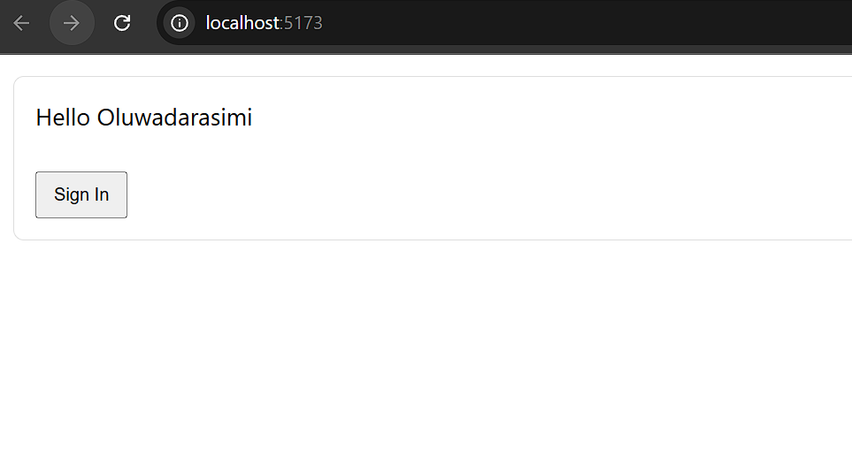

# Mini Server-Driven UI (SDUI) Demo — React + GraphQL

This is a small demo that shows **Server-Driven UI (SDUI)**:
the server returns a **UI schema** (JSON) over **GraphQL**, and the React client renders
the UI dynamically using a **component registry** + **recursive renderer**.

## Demo


# What this proves
- Separation of **data/config** from **presentation**
- A simple **SDUI renderer** (schema to components)
- “Platform-first” thinking (same schema could be rendered by web/mobile clients)

## Highlights
- Schema-driven rendering via a component registry
- Graceful fallback for unknown component types
- Easy to extend with new UI types (e.g., Spacer)

## Tech Stack
- React (Vite)
- Apollo Client (frontend GraphQL)
- Apollo Server (mock GraphQL backend)

## How it works 
1. React queries the GraphQL server for `screenConfig(screenId)`
2. Server returns a JSON schema like:

```json
{
  "type": "Screen",
  "children": [
    { "type": "Text", "props": { "value": "Welcome" } },
    { "type": "Spacer", "props": { "height": 16 } },
    { "type": "Button", "props": { "label": "Sign In" } }
  ]
}

Clone:
git clone <repo-url>
cd sdui-demo

Install dependencies:
npm install

Start the GraphQL server (Terminal 1):
node server/index.js

Start the React app (Terminal 2):
npm run dev

Open:
React UI: http://localhost:5173
GraphQL: http://localhost:4000

Enjoy!!!

## Additional Info
This template provides a minimal setup to get React working in Vite with HMR and some ESLint rules.

Currently, two official plugins are available:

- [@vitejs/plugin-react](https://github.com/vitejs/vite-plugin-react/blob/main/packages/plugin-react) uses [Babel](https://babeljs.io/) (or [oxc](https://oxc.rs) when used in [rolldown-vite](https://vite.dev/guide/rolldown)) for Fast Refresh
- [@vitejs/plugin-react-swc](https://github.com/vitejs/vite-plugin-react/blob/main/packages/plugin-react-swc) uses [SWC](https://swc.rs/) for Fast Refresh

# React Compiler

The React Compiler is not enabled on this template because of its impact on dev & build performances. To add it, see [this documentation](https://react.dev/learn/react-compiler/installation).

# Expanding the ESLint configuration

If you are developing a production application, I recommend using TypeScript with type-aware lint rules enabled. Check out the [TS template](https://github.com/vitejs/vite/tree/main/packages/create-vite/template-react-ts) for information on how to integrate TypeScript and [`typescript-eslint`](https://typescript-eslint.io) in your project.
